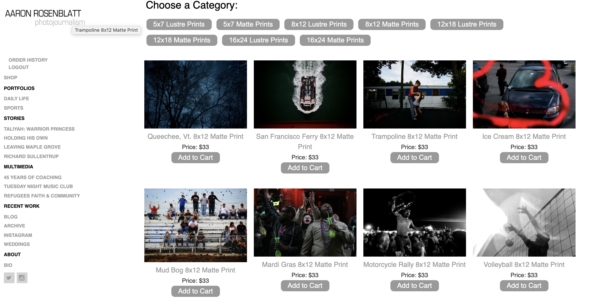

# aaronrosenblattphoto-shop

## by Aaron Rosenblatt

### I built a shop for my photojournalism website, http://www.aaronrosenblattphoto.com, which is designed and operated through Sam Exhibit. The shop was built using the MERN stack, with a React front end, MongoDB database, and Node.js/Express.js server and API. The e-commerce platform uses React's Context API. The Context API is managed with global state so the a site passes reducers, and extracts data from the store and dispatches actions.

### Aaron Rosenblatt Photo Shop can be viewed here: https://rosenblattphotoshop.herokuapp.com/

### The GitHub repository for Aaron Rosenblatt Photo Shop can be viewed here: https://github.com/noplur/aaronrosenblattphoto-shop

### Here is a screenshot of a sample from Rosenblatt Book Search:
### 